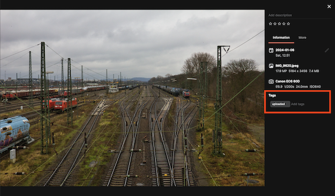
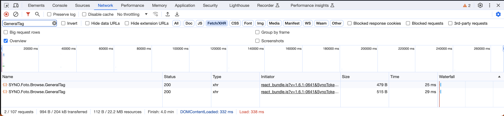
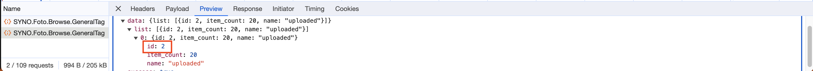

# Sync Synology Photos with Google Photos

This is a simple tool that helps to synchronize photos stored in Synology Photos with Google Photos.
It checks for existing Photos in Synology Photos and uploads them to Google Photos if they are not yet synced.

## Setup

* First download the binary available for your platform
* Afterwards update the packaged configuration.yaml file, further details see below
* Perform the first login to Google Photos, as they use OAuth 2.0 and a Browser is required to approve the access:
  `sync-google-photos --file configuration.yaml --login`
  This will open a browser and wait for login to be successful to place afterwards a file named `oauth-login-state.json` with the access- & refresh_token.
* Place the binary, `oauth-login-state.json` and `configuration.yaml` at a place you would like to run the binary from
* Create a crontab or smth else to execute the binary: `sync-google-photos --file configuration.yaml`

## Configuration.yaml-Filesync-google-photos --file configuration.yaml --login

The Configuration file has the following structure:

| Path | Description |
|------|-------------|
| `synologyConfiguration.url` | Url to the Synology NAS, this will be eigther the https or http url with ports 5001 or 5000 |
| `synologyConfiguration.username` | Synology Photos Username used for accessing the Photos |
| `synologyConfiguration.password` | Synology Photos Password used for accessing the Photos |
| `synologyConfiguration.insecureHttpsConnection` | If the Synology NAS uses a self-signed Certificate and you don't trust it, the insecure Https Connection will ignore this and continue without raising an Exception. This is against security best practices, use it with caution. |
| `synologyConfiguration.uploadedTagID` | For further details about this please check the section below |
| `googlePhotoConfiguration.clientID` | The OAuth 2.0 ClientID received from Google, for further details please check https://developers.google.com/photos/library/guides/get-started |
| `googlePhotoConfiguration.clientSecret` | For further details check the link mentioned in clientID |
| `googlePhotoConfiguration.localRedirectURL` | The configured `Authorized redirect URI` from the OAuth 2.0 Client ID request. This should be smth with localhost |

## synologyConfiguration.uploadedTagID

To be stateless the Sync Tool attaches to each Photo that is already synced from Synology Photos to Google Photos a Tag in Synology Photos.
To create the Tag please follow the described steps:

* Open Synology Photos
* Select a random Photo and click on Information
* Now create a new Tag (the name is up to you, I named it `uploaded`)
  
* Now open the Developer Console of your Browser
  * Chrome: https://developer.chrome.com/docs/devtools/open and open afterwards the `Network`-Tab
  * Firefox: https://firefox-source-docs.mozilla.org/devtools-user/web_console/ and open afterwards the `Network`-Tab
  * Edge: Seriously?? Search for a real Browser
  * Internet Explorer: Please turn of your PC
* Search for SYNO.Foto.Browse.GeneralTag requests:
  
* Click on the Requests, for me it was the second request of this type and then on Preview to show the Response Body
  
* Search for the Tag that you created in the third step and take the "id" field of it.
* Use this as value within the `synologyConfiguration.uploadedTagID` field in the Configuration.yaml-File